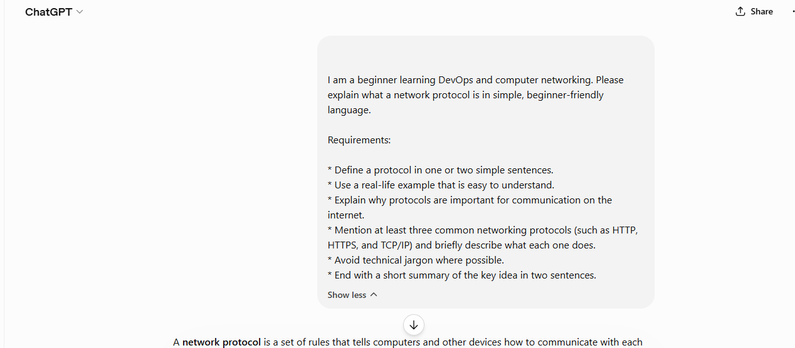
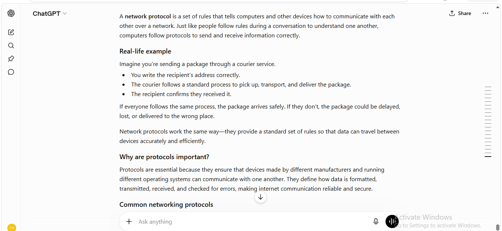
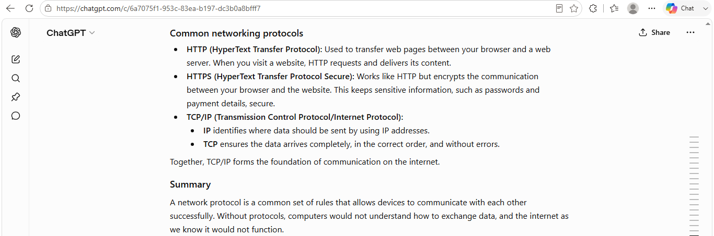
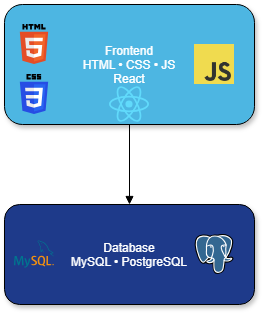
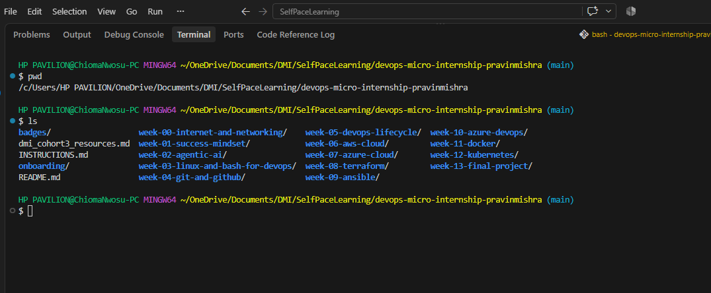

# Week 00 - Internet and Networking

Part of the DevOps Micro Internship (DMI) Cohort 3 with Agentic AI

---

# 🧑‍💻 Task 1: Using ChatGPT as Your Learning Assistant

## Scenario

You're new to DevOps and will frequently encounter technical questions. ChatGPT can be your learning companion.

## Your Task

Write a clear ChatGPT prompt to help you understand:

> "What is a protocol in networking? Explain with a simple real-life example."

Take a screenshot of your interaction showing:

* Your detailed prompt (with clear expectations)
* ChatGPT's simplified response with an example

## Screenshot

Save your screenshot in the `screenshots` folder and update the file name below.







---

## What I Learned (2–3 lines)

A protocol is a set of rules that allows devices to communicate and exchange information correctly over a network. I also learned that different protocols have different purposes, such as delivering web pages securely or ensuring data reaches its destination accurately.

---

# 🌐 Task 2: Internet and Networking

## Scenario

Your friend is launching an online bookstore named **EpicReads**.

He asked you to explain how users globally can access his website hosted in Finland.

## Your Task

Write a short explanation (**100–150 words**) that includes:

* Packet Switching
* IP Address
* TCP/IP
* HTTP/HTTPS

💡 **Tip:** You may use ChatGPT (as demonstrated in Task 1) to refine your explanation.

## Answer

When someone visits **epicreads.com**, their request is broken into small pieces called **packets** through a process known as **packet switching**. These packets travel across different networks and are reassembled when they reach the web server hosted in Finland.

Every device connected to the internet has an **IP address**, which acts like a digital home address, allowing data to reach the correct destination. The **TCP/IP** protocol suite ensures the packets are delivered accurately, in the correct order, and without errors. Once the connection is established, **HTTP** or the more secure **HTTPS** protocol is used to request and deliver the website's pages. Together, these technologies allow users anywhere in the world to access EpicReads quickly, reliably, and securely.

---

# 🏗️ Task 3: Application Architecture & Stack

## Scenario

EpicReads bookstore has two application versions:

### Two-Tier Application

* Frontend
* Database

### Three-Tier Application

* Frontend
* Backend
* Database

## Your Task

* Draw simple diagrams (hand-drawn or tool-based such as draw.io)
* Label each layer clearly
* List at least two common technologies or tools used for each layer
* Submit a screenshot or photo clearly showing your own drawing

## Diagram Screenshot / Photo

Save your diagram image in the `screenshots` folder and update the file name below.




---

## Technologies Used

### Frontend

* HTML, CSS, JavaScript
* React

### Backend

* Node.js (Express)
* Java Spring Boot

### Database

* MySQL
* PostgreSQL

---

# 🌍 Task 4: Domain Name & DNS (Basic Concepts)

## Scenario

Your friend's bookstore **EpicReads** is currently accessible through:

```text
52.172.142.222:3000
```

He purchased the domain:

```text
epicreads.com
```

## Your Task

In **50–100 words**, explain in your own words:

1. What is DNS (Domain Name System)?
2. Which DNS record type should be used to connect the domain to the given IP, and why?

## Answer

The **Domain Name System (DNS)** translates human-friendly domain names, such as **epicreads.com**, into IP addresses that computers use to locate servers on the internet. To connect **epicreads.com** to the server with the IP address **52.172.142.222**, an **A record** should be used because it maps a domain name directly to an IPv4 address. This allows users to access the website using an easy-to-remember domain instead of a numerical IP address.

---

# 💻 Task 5: Visual Studio Code Setup (Hands-on)

## Your Task

Install Visual Studio Code (if not already installed).

Take a screenshot of your VS Code environment showing:

* Terminal open inside VS Code
* Running a basic command:

### Windows

```powershell
dir
```

### Linux / macOS

```bash
pwd
ls
```

* Your selected VS Code theme clearly visible

⚠️ **Important:** The screenshot must show your username or another identifiable detail to confirm it is your environment.

## Screenshot

Save your screenshot in the `screenshots` folder and update the file name below.



---

# 🔗 Task 6: Publish Your Assignment as a LinkedIn Post

## Objective

Publishing on LinkedIn helps you:

* Build your professional online presence
* Reinforce your learning
* Document your DevOps journey publicly

## Your Task

Summarize your answers from Tasks 1–5 into a LinkedIn post.

Clearly structure your post into the following sections:

* ChatGPT
* Internet & Networking
* App Architecture
* DNS
* VS Code Setup

Add the following credit note at the end of your post:

> **P.S. This post is part of the DevOps Micro Internship (DMI) with Agentic AI — Cohort 3 — by Pravin Mishra. My graded progress is public: https://dmi.pravinmishra.com/s/YOUR-GITHUB-USERNAME.html · Start your DevOps journey: https://dmi.pravinmishra.com/?utm_source=student&utm_medium=ps-linkedin&utm_campaign=cohort3**

---

## LinkedIn Post URL

Paste your LinkedIn post URL here:

```text
https://www.linkedin.com/posts/chioma-nwosu-878788143_devops-cloudcomputing-aws-activity-7490734865529774080-Rss0?utm_source=share&utm_medium=member_desktop&rcm=ACoAACLSBtwB-QIbIm4359qMpRmDY8MP58tJ5i4```

---

## LinkedIn Post Backup Copy

Paste the full text of your LinkedIn post here:

🔄 Revisiting the Foundations: Strengthening My DevOps Journey


"One thing I have learned during my transition into Cloud and DevOps is that strong engineers never outgrow the fundamentals. As part of my DMI Self-Paced Learning journey, I revisited core networking concepts—not because they were new, but because deeper understanding creates stronger engineering decisions."


Here's what I worked on this week:

🤖 Using AI as a Learning Partner

I practised writing effective prompts to better understand networking concepts. Instead of asking for quick answers, I focused on getting beginner-friendly explanations with practical examples. It reminded me that the quality of the answers we receive often depends on the quality of the questions we ask.


🌐 Internet & Networking

I strengthened my understanding of how users anywhere in the world can access a website through packet switching, IP addresses, TCP/IP, and HTTP/HTTPS. These concepts form the foundation of reliable communication across the internet.


🏗️ Application Architecture

I compared two-tier and three-tier architectures and explored the role of each layer:

Frontend – where users interact with the application

Backend – where business logic is processed

Database – where information is stored and managed

Understanding how these components work together is essential for designing scalable and maintainable systems.


🌍 Domain Name System (DNS)

I learned how DNS translates human-friendly domain names into IP addresses, making websites easy to access while allowing computers to communicate efficiently. I also reinforced my understanding of DNS records, particularly how an A record maps a domain to an IPv4 address.


💻 Development Environment

I verified my Visual Studio Code environment, terminal setup, and workflow to ensure I'm ready for the hands-on projects ahead.


My Biggest Takeaway

This week reminded me that strong engineers don't skip the fundamentals. Understanding why technologies work is just as important as knowing how to use them. Every advanced cloud solution is built on these core networking principles, and strengthening them now will make me a better Cloud and DevOps Engineer in the future.

I'm excited to continue this journey, build more projects, document my progress, and keep learning one step at a time.


**P.S. This post is part of the DevOps Micro Internship (DMI) with Agentic AI — Cohort 3 — by Pravin Mishra. My graded progress is public: https://dmi.pravinmishra.com/s/Treasurematrix.html · Start your DevOps journey: https://dmi.pravinmishra.com/?utm_source=student&utm_medium=ps-linkedin&utm_campaign=cohort3


#DevOps #CloudComputing #AWS #Networking #Infrastructure #LearningInPublic #GitHub #TechJourney #ContinuousLearning #WomenInTech #DMI #PravinMishra
---

# Reflection – Week 0

### What did you find easy?

The networking concepts were familiar because of my previous cloud computing and DevOps studies. This assignment helped reinforce foundational knowledge while giving me another opportunity to explain the concepts in simple terms.
---

### What was difficult?

The most challenging part was simplifying technical concepts without losing accuracy. Explaining networking in beginner-friendly language required careful thought.
---

### What will you improve next week?

Next week, I will continue strengthening my documentation skills, create clearer diagrams, and focus on explaining technical concepts more confidently while maintaining practical, hands-on learning.
---

## 📌 About DMI & CloudAdvisory

DevOps Micro Internship (DMI) is a project-based DevOps program run by Pravin Mishra (The CloudAdvisory) focused on real-world execution, systems thinking, and career readiness.

It helps learners build strong DevOps foundations with hands-on experience.


## 📌 Resources

- 🌐 **DMI Official Website:** https://dmi.pravinmishra.com?utm_source=github&utm_medium=readme  
- 🎓 **University:** https://university.pravinmishra.com?utm_source=github&utm_medium=readme  
- 💬 **Discord Community:** https://discord.pravinmishra.com?utm_source=github&utm_medium=readme  
- 📝 **Blog:** https://dmi.pravinmishra.com/blog?utm_source=github&utm_medium=readme  
- ▶️ **YouTube Playlist (DMI Cohort 3):** https://www.youtube.com/playlist?list=PLFeSNDtI4Cho  
- 🔗 **Pravin Mishra (LinkedIn):** https://www.linkedin.com/in/pravin-mishra-aws-trainer/  
- 🏢 **CloudAdvisory (LinkedIn):** https://www.linkedin.com/company/thecloudadvisory/

---

*This submission is part of DevOps Micro Internship (DMI) Cohort 3 — Agentic AI Track*